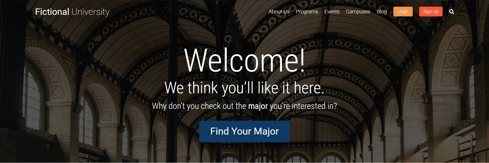

# Fictional University

A customized WordPress Powered site built for a fictional university.

## About Fictional University

I am currently learning how to customize a WordPress powered site by writing code in PHP. I have previous experience creating basic websites in WordPress using the Elementor plug-in, but I wanted grow my skillset by learning how to add my own custom code.

Below are some of the tasks I will be tackling to complete this project:

- I will begin learning how to code in PHP (Hypertext Preprocessor), which is an open-source, server-side scripting language that is often imbedded in HTML pages to create dynamic web pages.
- Covert a HTML template into a WordPress theme.
- Create custom post types and custom fields.
- Leverage the WP REST API.
- Learn to use JavaScript to communicate with the WordPress back-end on-the-fly.
- Let users sign up for an account on the site.
- Build a "My Notes" feature (user specific single page application with real-time CRUD actions).
- Let users "like" or "heart" a professor (update the professor's like count on-the-fly).

## Why I wanted to tackle this project and learn PHP?
I was recently hired to build a WordPress site for a customer, and since I had previous experience with coding, I thought it was be great to learn how to incorporate some of my those skills into customizing future sites. I am an avid believer in life-long learner, and I want to continue to grow and develop my skills in whatever areas that peak my interest. Since PHP is the primary programming language used in WordPress, I thought it would be a great next step to tackle.

## Curent progress 
- 8% complete.

## Built with

- HTML
- CSS
- JavaScript
- PHP

